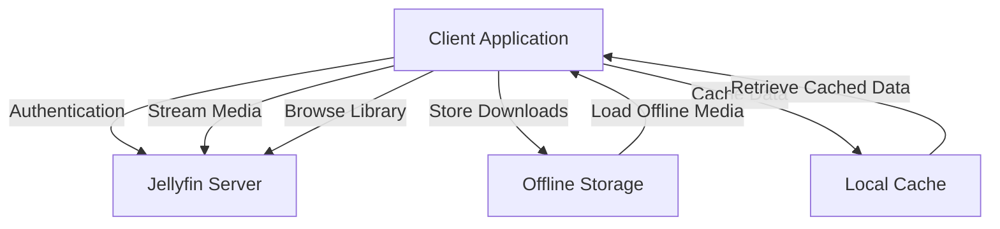

# Jellyfin Client Application

A lightweight desktop client application for streaming media content from a Jellyfin server. This application focuses on providing essential media streaming features with a clean, user-friendly interface.

## Features

- 🔐 Simple authentication with your Jellyfin server
- 📚 Browse and search your media library
- ▶️ Stream content with basic playback controls
- 💾 Download media for offline viewing
- 📱 Cross-platform support (Windows & Linux)

## Theming System

The application uses a robust theming system that provides consistent styling across the app. The system is built using SwiftUI and supports both light and dark modes.

### Theme Manager

The `ThemeManager` class manages the application's theme state and provides access to theme properties through SwiftUI's environment:

```swift
@Environment(\.themeManager) var themeManager
```

### Available Themes

#### Dark Theme
- Background: Deep navy blue base (RGB: 5, 7, 15)
- Accent: Jellyfin purple with blue gradient
- Text: White with varying opacity levels
- Cards: Elevated surfaces with subtle gradients

#### Light Theme
- Background: Light navy base (RGB: 45, 48, 58)
- Accent: Bright sunny orange with coral gradient
- Text: White with high contrast
- Cards: Light elevated surfaces with subtle gradients

### Usage Example

```swift
struct ContentView: View {
    @Environment(\.themeManager) var themeManager
    
    var body: some View {
        Text("Hello")
            .foregroundColor(themeManager.currentTheme.primaryTextColor)
            .background(themeManager.currentTheme.backgroundColor)
    }
}
```

### Theme Properties

All themes provide consistent access to:

- Colors:
  - `backgroundColor`: Main background
  - `surfaceColor`: Surface elements
  - `elevatedSurfaceColor`: Elevated UI elements
  - `accentColor`: Primary accent
  - `primaryTextColor`: Main text
  - `secondaryTextColor`: Secondary text
  - `tertiaryTextColor`: Tertiary text

- Gradients:
  - `accentGradient`: Brand accent gradient
  - `backgroundGradient`: Background variations
  - `textGradient`: Text effects
  - `overlayGradient`: Overlay effects
  - `cardGradient`: Card backgrounds

## Architecture



## Getting Started

*Documentation coming soon*

## Development

This project is currently in active development. For detailed specifications, see our [Product Requirements Document](product-info/prd.md).

### Current Status

MVP development in progress, focusing on core features:
- Authentication system
- Media library browser
- Basic video playback
- Offline download capability

## License

*License information coming soon*

## Contributing

*Contribution guidelines coming soon*
